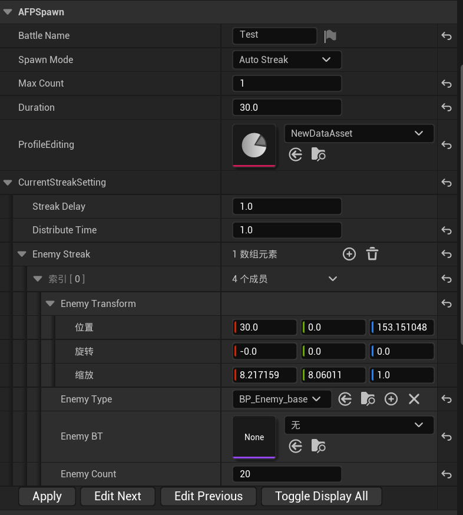

[阅读中文文档](ReadMeCN.md)
# AFPEnemySpawner

An Enemy Spawner Written For *Arknights FP*.

## AFPSpawnerProfile

Data asset that holds information about enemy spawns.

### Params:

**BattleName:**

Text, Optional Name of this fight.

**SpawnMode:**

Enum, How the spawner is going to Spawn Enemies.

​	EEnemySpawnMode:

​		AutoStreak: Each wave of enemies will spawn after the previous wave has been eliminated.

​		MaxCount: Keep the number of enemies spawned at the MaxCount until the enemies to spawn been exhausted.

​		LoopInTime: Similar to AutoStreak, But enemy waves loops until the time limit reached. This is designed to make some survival challenges.

**MaxCount:**

Int, Valid only when using MaxCount mode.

**Duration:**

Float, Time limit in seconds, Valid only when using LoopInTime mode.

**Streaks:**

Array of enemy waves. An enemy wave consists of the delay, the distribution time and an array of subwaves.

**StreakDelay:**

Initial delay of the wave in seconds.

**DistributeTime:**

The time it takes for this wave of enemies to spawn from start to complete in seconds.

**EnemyTransform:**

Transform of the enemy spawned in a subwave， will be affected by the spawner transform. Notice that Scale would not be applied. Instead, Scale will define the bounding box size for randomizing enemy location when the enemy count is greater than 1. Spawned enemies will be snapped to floor.

**EnemyType:**

Subclass of APawn, Enemy class to spawn.

~~EnemyBT:~~

~~Behavior tree for enemy to run after spawned. Optional.~~(deprecated)

**EnemyCount:**

Int, Number of enemies to spawn in a subwave.

## AFPEnemySpawnerEditor

A tool for editing SpawnProfile within the editor, does not work at runtime.

**No documentation. Just try it out.**

## AFPEnemySpawnerActor

Actor that holds SpawnProfile and spawn enemy pawns at runtime.

### Params:

**AutoStart:**

bool, If true, the spawner starts spawning once the game begins to play.

**SpawnProfileList:**

Array of SpawnProfiles to use. The spawner randomly picks one of them. This is useful when making some dungeon/ roguelike stuff.

### Blueprint Utilities:

**BindEventToOnEnemiesEliminated:**

This will be called when all enemies are eliminated.

**BindEventToOnSpawnCompleted:**

This will be called when all enemies have been spawned.

**BindEventToOnWaveSwapped:**

This will be called in AutoStreak mode when enemy wave changed.

**StartSpawning:**

Start spawning. Duplicate calls will be ignored.

**GetBattleName:**

Returns the fight name text.

**GetSurvivingEnemies:**

Returns an array of current existing enemies.

**GetRemainingTime:**

Returns the remaining time of the battle in seconds. Return -1 if the spawn mode != LoopInTime.

## About

About this plugin.

AFPEnemySpawner was written by Skylake when developing his fan game *Arknights FP*.

This plugin provides a lightweight implementation of enemy spawning, feel free to try it out.

Some default uassets created in UE5 may not be compatible with UE4.x. Create them yourself.

