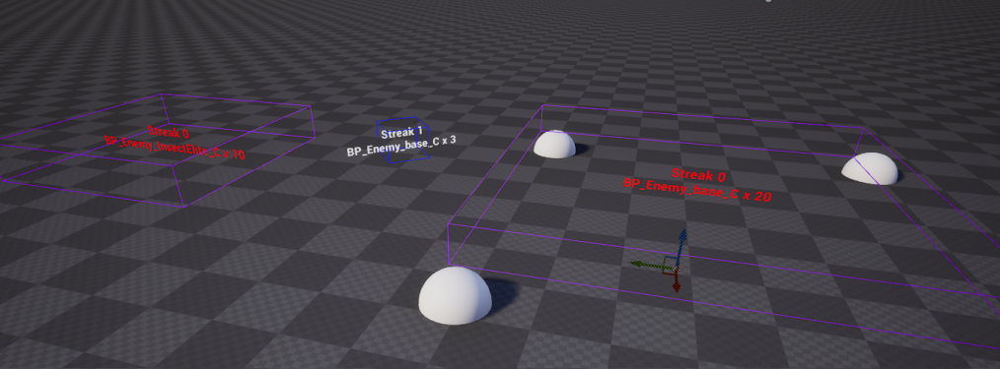
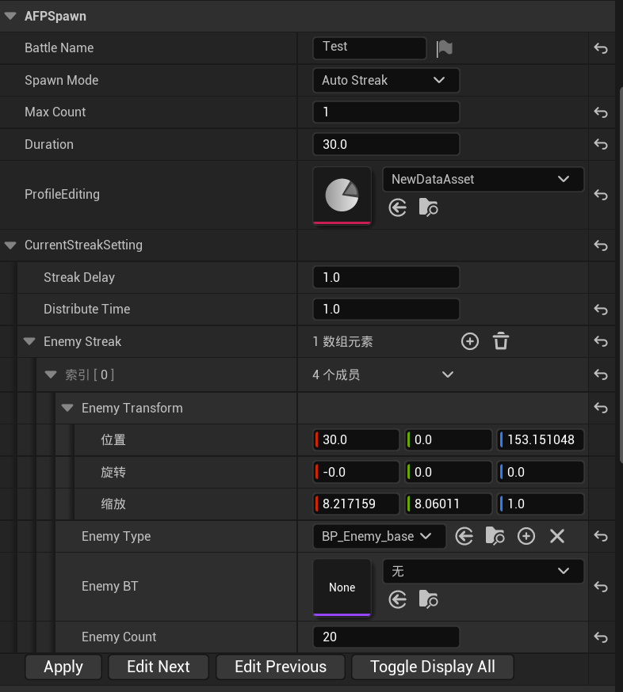

# AFPEnemySpawner

为 *Arknights FP*编写的敌人生成插件。

## AFPSpawnerProfile

存储敌人生成行为的数据资产。

### 参数:

**BattleName:**

FText，该战斗的可选名称。

**SpawnMode:**

枚举，敌人的生成模式。

​	EEnemySpawnMode:

​		AutoStreak: 自动波次：每一波次的敌人将在上一波次的敌人消灭后自动开始生成。

​		MaxCount: 最大数量：维持生成在场的敌人数量在给定的最大值，直至列表中的待生成敌人耗尽。

​		LoopInTime: 时间内循环：与自动波次相似，但敌人波次会在给定的时间限制内循环生成，这可以被用在一些生存挑战中。

**MaxCount:**

Int， 敌人最大在场数。仅在最大数量模式下有效。

**Duration:**

Float, 以秒为单位的战斗时间限制。仅在时间内循环模式下有效。

**Streaks:**

敌人波次的数组。一个敌人波次包含初始延迟、分布时间和一个子波次的数组。

**StreakDelay:**

该波次开始生成前延迟的时间（秒）。

**DistributeTime:**

从波次开始生成到生成完毕花费的时间（秒）。

**EnemyTransform:**

一个子波次中敌人的生成变换，受生成器位置影响。缩放分量不会被应用，而是决定一个包围盒的大小。在子波次敌人数大于1时，敌人生成位置将在这个包围盒中随机散布。生成的敌人将会自动吸附到地面。

**EnemyType:**

Pawn的子类，要生成的敌人类型。

~~EnemyBT:~~

~~敌人生成后自动运行的行为树。（可选）~~(已弃用)

**EnemyCount:**

Int，一个子波次中敌人的数量。

## AFPEnemySpawnerEditor

编辑 SpawnProfile 的编辑器工具，在运行时没有作用。

**不知道怎么写文档，自己试着用吧。**

## AFPEnemySpawnerActor

使用我们编辑的SpawnProfile，并在运行时生成敌人的actor。

### 参数:

**AutoStart:**

bool，生成器是否在游戏开始时自动调用开始生成。

**SpawnProfileList:**

SpawnProfile 的数组，生成器会随机取一份来执行，以实现肉鸽之类的随机关卡效果。

### 蓝图功能:

**BindEventToOnEnemiesEliminated:**

绑定到敌人歼灭 委托：将在敌人全部消灭时调用。

**BindEventToOnSpawnCompleted:**

绑定到敌人生成完毕 委托：将在所有敌人生成完毕时调用

**BindEventToOnWaveSwapped:**

绑定到波次改变时 委托：将在生成新的波次时调用。

**StartSpawning:**

开始生成：手动调用生成敌人。重复的调用将被忽略。

**GetBattleName:**

返回战斗名称。

**GetSurvivingEnemies:**

返回当前场上（该生成器生成的）存在的敌人列表。

**GetRemainingTime:**

返回剩余战斗时间（秒）。如果生成模式不是时间内循环，返回-1。

## 关于

关于这个插件。

AFPEnemySpawner  是b站上的Skylake在开发他的二创游戏 *Arknights FP*时顺手写的。

这款插件提供了敌人生成的一个轻量化的实现，请随意品鉴。

某些默认资产是在UE5下创建的。如果要在UE4内使用的话，请手动创建同名资产。

